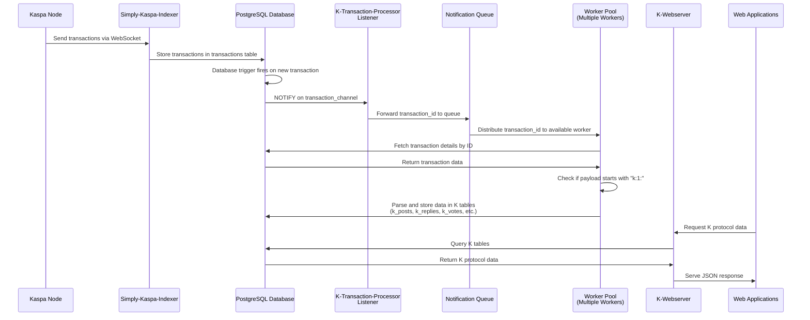

# KaChat Indexer

**KaChat Indexer** is the KaChat-owned indexer powering KaPosts (social) and KaChat
broadcasts. It is a fork of [thesheepcat/K-indexer](https://github.com/thesheepcat/K-indexer)
extended with: server-side KaChat-only exclusivity, text-only content validation, removal
counter-actions (`unvote`/`unquote`), a per-post engagement endpoint, KaChat broadcast
indexing (`#kaspa` / `#kachat-bugs`, 3-day retention), and a **KaChat Indexer** admin
dashboard (`K-admin`) that will grow into the single pane of glass for all of it.

## 🚀 Want to run your own indexer?

**→ Follow [`INSTALL.md`](INSTALL.md) — a step‑by‑step, cross‑platform self‑hosting guide**
(Linux, Windows, macOS) covering Docker, the indexer itself, optional **Portainer**, and
**nginx‑proxy‑manager** for HTTPS. Start there.

- **Deep‑dive deploy notes:** [`KAPOSTS.md`](KAPOSTS.md) and [`docker/kachat/DEPLOY.md`](docker/kachat/DEPLOY.md).
- **Upstream lineage** is preserved in git history and the `upstream` remote; the original
  K-indexer docs follow below.

---

## Upstream: K-indexer

K-indexer is a simplified Kaspa transaction indexer designed specifically for indexing and serving K protocol transactions.

## 🚀 New Architecture

The new indexer architecture is composed of the following components:

- **🔗 Rusty-Kaspa Node**: A running rusty-kaspa node
- **💾 PostgreSQL Database**: Database for storing indexed data
- **📡 Simply-kaspa-indexer**: By supertypo (https://github.com/supertypo/simply-kaspa-indexer) to receive all transactions from Kaspa network and temporarily store them
- **🔍 K-transaction-processor**: Filters incoming transactions and indexes all K-related data in proper database tables
- **🌐 K-webserver**: Serves all K-related data to web applications via API calls
- **🧹 K-database-cleaner** *(Optional)*: Maintains a lighter, cleaner database for personal indexers by automatically purging unwanted content

### Process Flow



## 📚 Protocol Documentation

Technical specifications for the K protocol are available in the [official K repository](https://github.com/thesheepcat/K).

---

## 🛠️ Installation & Setup

### Prerequisites

- Linux Ubuntu server (recommended)
- Rust toolchain
- Docker
- Running rusty-kaspa node

### 📋 Step-by-Step Instructions

To run the indexer, proceed in the following way:

#### 1. **Activate Rusty-Kaspa Node**
Follow the [documentation here on how to run rusty-kaspa](https://kaspa.aspectron.org/running-rusty-kaspa.html)

**Required Node Parameters:**
- `--utxoindex`: Enable UTXO indexing
- `--rpclisten-borsh=0.0.0.0:17120`: Enable BORSH RPC on all interfaces

#### 2. **Setup enviroment variables**
Navigate to docker/PROD folder, open .env file and set the variables depending on your preferences:

```bash
cd K-indexer/docker/PROD
nano .env
```
##### Variables description
| Variable | Default | Description |
|-----------|---------|-------------|
| `COMPOSE_PROFILES` | `public-indexer` | Indexer type: `public-indexer` or `personal-indexer` |
| `DB_USER` | `username` | PostgreSQL database username |
| `DB_PASSWORD` | `password` | PostgreSQL database password |
| `DB_NAME` | `k-db` | PostgreSQL database name |
| `DB_PORT` | `5432` | PostgreSQL database access port |
| `WEBSERVER_PORT` | `3000` | K-webserver access port (used by K-webapp, to connect to K-indexer) |
| `USER_PUBKEY` | - | Your Kaspa public key (required only for `personal-indexer`) |
| `DATA_RETENTION` | `72h` | How long to keep content from non-followed users (required only for `personal-indexer`) |
| `PURGE_INTERVAL` | `10m` | How often to run cleanup operations (required only for `personal-indexer`) |

**IMPORTANT**:
- Change `DB_USER` and `DB_PASSWORD` to secure values
- Set `COMPOSE_PROFILES` to `personal-indexer` and configure `USER_PUBKEY`, `DATA_RETENTION`, and `PURGE_INTERVAL` if running a personal indexer with k-database-cleaner

#### 3. **Activate all Services**
Navigate to docker/PROD folder and use docker compose to activate all services:

```bash
cd K-indexer/docker/PROD
docker compose up -d
```
The following services will be activated:
- k-indexer-db (PostgreSQL database)
- simply-kaspa-indexer
- k-transaction-processor
- k-webserver
- k-database-cleaner (only if set as "personal indexer")
- portainer (container management UI)

#### 4. **Monitor Services with Portainer**

Portainer provides a web-based interface to monitor and manage your Docker containers.

Access Portainer at:
```
http://localhost:9000
```

**First-time Setup:**
- Create an admin password when prompted
- Select "Get Started" to connect to the local Docker environment

**What You Can Do:**
- **Monitor container health**: Check running/stopped status of all services
- **View logs**: Real-time and historical logs for troubleshooting
- **Resource usage**: CPU, memory, and network statistics
- **Restart containers**: Quick restart without terminal access
- **Execute commands**: Access container shells directly from the browser

---

## 📖 API Endpoints

Once running, K-indexer provides REST endpoints the K webapp.

You can find all details of the API techical specification in the [API_TECHNICAL_SPECIFICATIONS.md](API_TECHNICAL_SPECIFICATIONS.md) document.

---

## 🧹 Personal Indexer with K-database-cleaner

For users running a **personal indexer**, K-database-cleaner helps maintain a lightweight, efficient database by automatically removing unwanted data based on your preferences.

### Why Use K-database-cleaner?

When running a personal indexer, you may not want to store:
- Content from users you've blocked
- Old posts from users you don't follow
- Orphaned replies and votes that reference deleted content
- Follow/block records from other users

K-database-cleaner runs periodic purge operations to keep your database clean and storage-efficient, retaining only the content that matters to you.

### Key Features

- **Automated Cleanup**: Runs at configurable intervals (default: every 10 minutes)
- **Configurable Retention**: Set how long to keep content from non-followed users (default: 72 hours)
- **Single Query per Operation**: Optimized CTEs for efficient purging
- **Detailed Logging**: Reports exactly what was deleted in each cycle

### Getting Started

For full documentation on installation, configuration, and usage, see the [K-database-cleaner README](K-database-cleaner/README.md).

---

## 🗑️ Content Removal with K-content-remover

For operators running a **public indexer**, K-content-remover provides a simple way to remove harmful, spam, or unwanted content created by specific users from your database.

### Why Use K-content-remover?

Public indexers may need to remove:
- Spam content from malicious users
- Harmful or unwanted content from malicious users

K-content-remover allows you to completely remove all content associated with a specific public key in a single, atomic operation.

### Key Features

- **One-time Execution**: Run on-demand when needed
- **Dry-Run Mode**: Preview what will be deleted before committing
- **Confirmation Required**: Safety prompt to prevent accidental deletions
- **Atomic Transaction**: All-or-nothing deletion ensures database consistency
- **Detailed Reporting**: Shows exactly what was removed from each table

### Getting Started

For full documentation on installation, configuration, and usage, see the [K-content-remover README](K-content-remover/README.md).

---

## 📊 K-Webserver Performance Monitoring

For operators running a **public indexer**, monitoring K-webserver performance is essential to ensure optimal API response times and identify potential bottlenecks.

### Why Monitor K-Webserver?

Public indexers should monitor:
- **Request rates**: Track API endpoint usage and traffic patterns
- **Response times**: Detect performance degradation and slow queries
- **Resource utilization**: Identify endpoints that need optimization
- **Error rates**: Monitor HTTP status codes and failures

### Monitoring Stack

The K-Webserver monitoring solution provides:
- **Real-time dashboards**: Pre-configured Grafana dashboards for all API endpoints
- **Prometheus metrics**: Automatic collection of performance metrics every 15 seconds
- **Rolling window analytics**: 1-minute rolling averages for request rates and response times
- **Easy setup**: Fully automated provisioning via Docker Compose

### Getting Started

For complete setup instructions, configuration options, and troubleshooting, see the [K-Webserver Monitoring Guide](docker/K-WEBSERVER-MONITORING/K-WEBSERVER-MONITORING.md).

---

## ⚠️ Important

**This code is a PROOF OF CONCEPT** designed to demonstrate K's potential to the Kaspa community and showcase a real solution to genuine problems faced by users worldwide.

While K has the potential to become a feature-rich, widely-adopted platform, the current version is experimental and includes:
- 🐛 Bugs and unexpected behaviors
- 🐌 Inefficient processes in some areas
- 🎨 User interface/experience improvements needed
- 🔧 Missing features and functionality

**By using K, you accept these limitations as part of the development process.**

---

## 💬 Support & Community

Need help or want to connect with other K users and developers?

**Join the Kluster Discord server**: https://discord.gg/vuKyjtRGKB

---