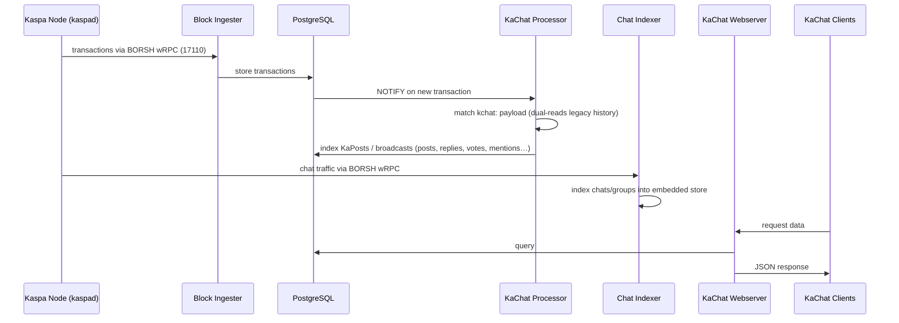

# KaChat Indexer

> ## 🖥️ Looking for the app? → **[Quick-Start-Kaspa](https://github.com/KaspaSilver/Quick-Start-Kaspa)**
>
> **[Quick-Start-Kaspa](https://github.com/KaspaSilver/Quick-Start-Kaspa)** is the web control
> panel — one command brings up a Kaspa node with a friendly GUI where you switch on services
> like KaChat. It references and manages the backend repos (this one included) for you, so
> setup and updates happen from the panel.
>
> **This repository is the backend — the engine under the hood.** It documents and houses the
> KaChat *indexer*: the services that read the chain and serve KaChat's APIs. Read on to
> understand how KaChat works internally or to run the indexer directly. For the actual web app,
> head to **[Quick-Start-Kaspa](https://github.com/KaspaSilver/Quick-Start-Kaspa)**.

**KaChat Indexer** is the engine behind **KaChat** — the cross-platform Kaspa messenger and
social network (iPhone, Android, and the [KaChat Desktop web app](https://github.com/KaspaSilver/KaChat-Desktop)).
It reads the Kaspa chain and turns KaChat's on-chain `kchat:` traffic into fast REST APIs
that every KaChat client talks to.

One indexer serves all of KaChat:

- **💬 Direct & group chats** — end-to-end encrypted messaging, handshakes, payments, group control.
- **📣 Broadcasts** — public rooms (e.g. `#kaspa`, `#kachat-bugs`) with configurable retention.
- **📝 KaPosts** — the social feed: posts, replies, quotes, votes, follows, blocks.
- **🔔 @mentions & push** — client-resolved `@` mentions surface as notifications; optional
  APNs (iOS) and FCM (Android) delivery.
- **📊 Admin dashboard** — a single pane of glass (services, chain sync, database + chat-store
  size, live stats).

KaChat runs on its own on-chain identifier, **`kchat:`**, so it is its own network — while still
reading legacy history so nothing from before the rebrand is lost.

---

## 🚀 Run your own KaChat Indexer — one command

> Most people should use **[Quick-Start-Kaspa](https://github.com/KaspaSilver/Quick-Start-Kaspa)**
> instead — it wraps this in a GUI. The command below runs the indexer backend **directly**, no
> panel, for operators who want just the engine.

This downloads Docker (if needed), a full Kaspa node, Postgres, the KaChat app, plus
**Portainer** (monitoring) and **nginx-proxy-manager** (HTTPS) — and starts all of it in Docker.

```bash
curl -fsSL https://raw.githubusercontent.com/KaspaSilver/kachat-indexer/main/install.sh | bash
```

Works on **Linux**, **macOS**, and **Windows** (run it in **WSL2** or **Git Bash** — Docker
Desktop sets up WSL2 for you). Nothing else to install first; the command handles the rest.

### 🧹 Remove everything — one command

Tears down the whole stack, deletes its data volumes and downloaded images, and removes the
files it cloned. (It leaves Docker itself installed and asks you to type `yes` first.)

```bash
curl -fsSL https://raw.githubusercontent.com/KaspaSilver/kachat-indexer/main/uninstall.sh | bash
```

---

## 📦 What the one command sets up

| Container | What it is | Notes |
|---|---|---|
| **kaspad** | A full Kaspa node (rusty-kaspad) — the chain source | RPC on **16110** (gRPC) and **17110** (BORSH wRPC); `--utxoindex` on. Bound to the host, so it doubles as **your own node**. |
| **kachat-db** | PostgreSQL 17 | KaPosts + broadcast tables |
| **kachat-app** | The KaChat indexer itself | Block ingester + `kchat:` processor + REST API + chat indexer + admin, under one supervisor |
| **nginx-proxy-manager** | HTTPS front door *(optional)* | Only started if you're not already running one |
| **portainer** | Docker monitoring UI *(optional)* | Only started if you're not already running one |

The installer is safe to re-run — it fast-forwards the repo, keeps your existing `.env`, and
won't start a second Portainer or nginx-proxy-manager if you already have one.

### Ports & endpoints

| Service | URL / port | |
|---|---|---|
| Kaspa node RPC | `127.0.0.1:16110` (gRPC), `127.0.0.1:17110` (BORSH wRPC) | use your own node |
| KaPosts REST API | `http://localhost:3080` | try `/health` |
| Chat indexer API | `http://localhost:8600` | |
| Admin dashboard | `http://localhost:3081` | loopback only — reach it over an SSH tunnel |
| Portainer | `http://localhost:9000` | set an admin password on first visit |
| nginx-proxy-manager | `http://localhost:81` | first login `admin@example.com` / `changeme` — **change it immediately** |

> **First run:** the bundled Kaspa node has to sync before chat and KaPosts data appear.
> Watch it with `docker logs -f kaspad`. Everything else is up and waiting in the meantime.

---

## 📊 Monitoring with Portainer

Portainer gives you a browser dashboard for the whole stack at **http://localhost:9000**:

- Health, uptime, and CPU/memory for every KaChat container
- Live and historical **logs** for troubleshooting
- One-click **restart**, or open a container shell — no terminal needed

You also get KaChat's own **admin dashboard** (Services, chain sync, database + chat-store size,
live stats) at `http://localhost:3081`. It binds to loopback for safety; reach it with an SSH
tunnel: `ssh -L 3081:localhost:3081 <your-server>`, then open `http://localhost:3081`.

## 🔒 HTTPS with nginx-proxy-manager

To put your indexer behind a domain with a free Let's Encrypt certificate:

1. Open **http://localhost:81** and log in (`admin@example.com` / `changeme`, then change it).
2. Add a **Proxy Host** for your domain pointing at `host.docker.internal` port `3080` (REST API)
   — and another for `host.docker.internal` port `8600` (chat API).
3. Enable **SSL → Request a new certificate** and **Force SSL**.

Your clients then talk to `https://your-domain` instead of raw ports.

---

## ⚙️ Configuration

Settings live in `docker/kachat/selfhost/.env` (generated on first install, with a fresh random
database password and push secret). Common knobs:

| Variable | Default | Description |
|---|---|---|
| `NETWORK` | `mainnet` | Kaspa network the node + indexer run on |
| `KASPA_NODE_ADDRESS` / `KASPA_NODE_PORT` | `127.0.0.1` / `17110` | Node BORSH wRPC endpoint — repoint to use an existing node instead of the bundled one |
| `WEBSERVER_PORT` | `3080` | KaPosts REST API port |
| `CHAT_API_PORT` | `8600` | Chat indexer API port |
| `ADMIN_PORT` | `3081` | Admin dashboard (loopback) |
| `FCM_PROJECT_ID` | *(empty)* | Set to enable Android push (drop the service-account JSON on the app data volume) |

Push notifications are **off** by default (self-hosters have no Apple/Firebase credentials);
device registration still works — only delivery is a no-op until you add your own keys.

After editing `.env`, apply changes with:

```bash
cd ~/kachat/kachat-indexer/docker/kachat/selfhost && docker compose up -d
```

---

## 🧩 Architecture



**Components** (all built from this repo, run under one supervisor in `kachat-app`):

- **Block ingester** — pulls transactions from the node into Postgres (via
  [simply-kaspa-indexer](https://github.com/supertypo/simply-kaspa-indexer)).
- **kachat-transaction-processor** — matches `kchat:` (and legacy) payloads and indexes KaPosts +
  broadcasts.
- **kachat-webserver** — the public REST API every KaChat client uses.
- **Chat indexer** — indexes direct/group chats into an embedded store.
- **kachat-admin** — the ops/admin dashboard.
- **kachat-database-cleaner** / **kachat-content-remover** — optional retention & moderation tools
  (see their folders).

---

## 📖 Documentation

- **API reference:** [`API_TECHNICAL_SPECIFICATIONS.md`](API_TECHNICAL_SPECIFICATIONS.md)
- **KaPosts:** [`KAPOSTS.md`](KAPOSTS.md) · **@mentions client contract:** [`KACHAT_KAPOST_MENTIONS_CLIENT_SPEC.md`](KACHAT_KAPOST_MENTIONS_CLIENT_SPEC.md)
- **`kchat:` client migration:** [`KCHAT_CLIENT_MIGRATION.md`](KCHAT_CLIENT_MIGRATION.md)
- **Notifications:** [`INDEXER_NOTIFICATIONS_REFERENCE.md`](INDEXER_NOTIFICATIONS_REFERENCE.md)
- **Operator deploy notes:** [`docker/kachat/DEPLOY.md`](docker/kachat/DEPLOY.md) · **manual install:** [`INSTALL.md`](INSTALL.md)

---

## 🛠️ Manual / advanced setup

The one-command installer uses [`docker/kachat/selfhost/`](docker/kachat/selfhost/). To run it by hand:

```bash
git clone https://github.com/KaspaSilver/kachat-indexer.git
cd kachat-indexer/docker/kachat/selfhost
cp .env.example .env          # then set DB_PASSWORD + INTERNAL_PUSH_SECRET
docker compose --profile proxy --profile monitor up -d --build
```

To point at an **existing** Kaspa node instead of the bundled one, set `KASPA_NODE_ADDRESS` /
`KASPA_NODE_PORT` in `.env` and drop the `kaspad` service. The operator stack that powers the live
KaChat network lives in [`docker/kachat/`](docker/kachat/) (`DEPLOY.md`).

---

## 📜 Lineage & license

KaChat Indexer began as a fork of [thesheepcat/K-indexer](https://github.com/thesheepcat/K-indexer)
and has since grown into KaChat's own indexer — its own `kchat:` network identifier, chat + group +
broadcast indexing, @mention notifications, a unified admin dashboard, and this turnkey installer.
Upstream lineage is preserved in git history. Licensed under the terms in [`LICENSE`](LICENSE).

## 💬 Support

Questions or issues? Open a [GitHub issue](https://github.com/KaspaSilver/kachat-indexer/issues),
or email kaspasilver@gmail.com
